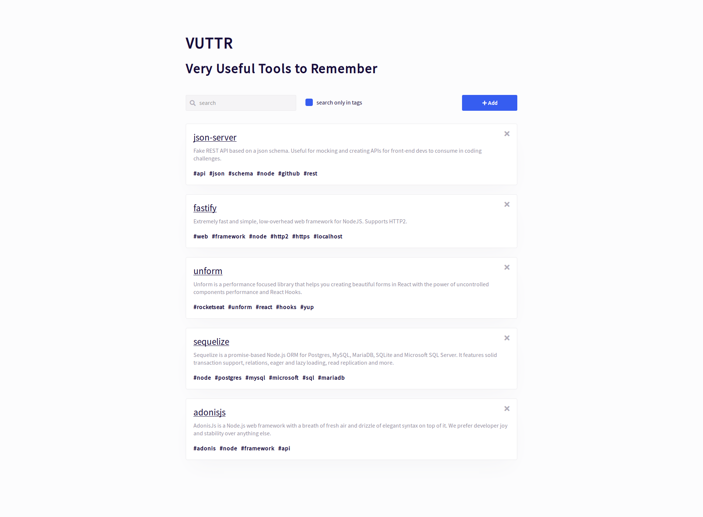
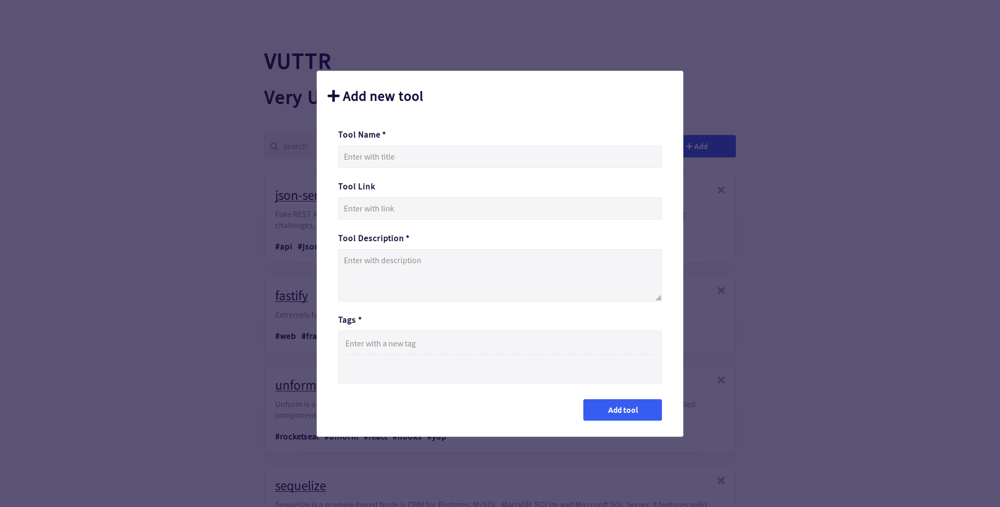
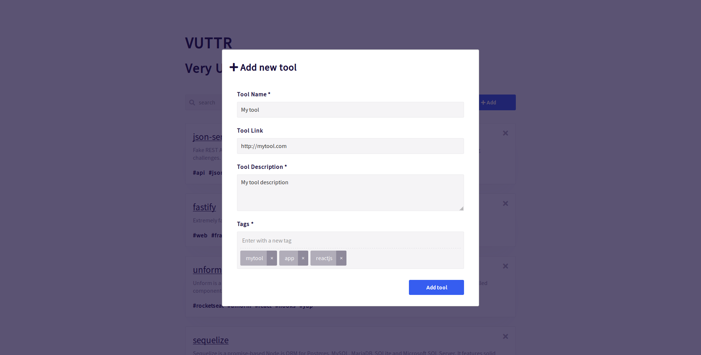
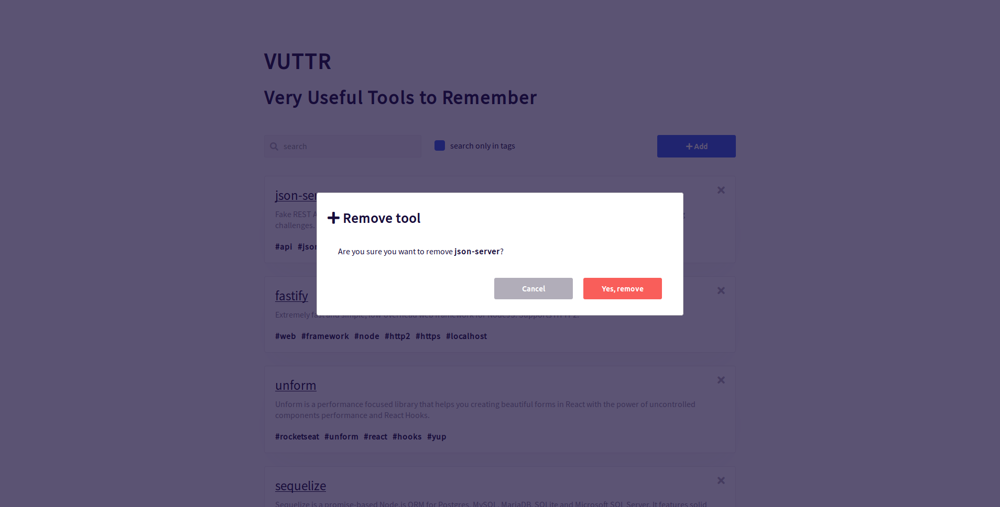

# VUTTR - Very Useful Tools to Remember

This project was created to BossaBox Challenge - Front-end.

#### List items



#### Add new tool (modal)




#### Remove tool (modal)



<br />

## How to Start Application?

Start the <b>VUTTR Server API</b> - back-end application ([https://github.com/thiagodesouza/vuttr-server-mock](https://github.com/thiagodesouza/vuttr-server-mock));

### Run Application

To configure and start <b>VUTTR APP</b>, open your terminal and enter with commands:

```shell
# install dependencies
$ yarn || npm install

# create a .env file
$ yarn configure || npm run configure

# run application
$ yarn start || npm start
```

### Run Application - Docker Container

```shell
# create an image
$ docker build -t vuttr-app .

# run application (port: 3099)
$ docker run --name vuttr-app -p 3099:3000 -d vuttr-app
```

<br/>

Best regards,

**Thiago Rodrigues de Souza** \
**email:** email@thiagodesouza.com.br \
**site:** [https://www.thiagodesouza.com.br](https://www.thiagodesouza.com.br)
